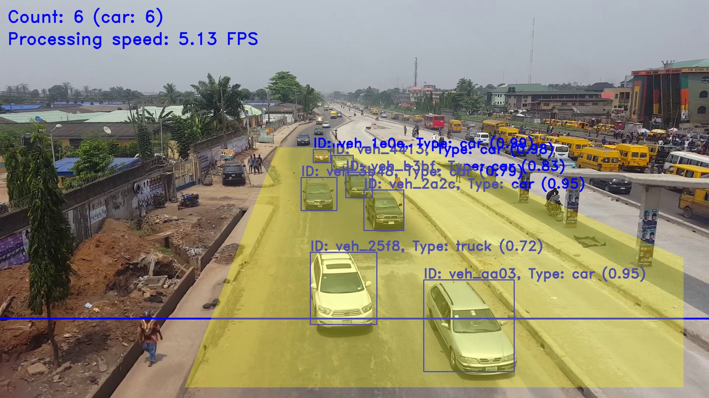

# Ivy
Ivy is an open source video-based vehicle counting system which employs several computer vision techniques to detect, track and count vehicles in a traffic scene.



## Requirements
- Python 3

## Setup
- Clone this repo `git@github.com:nicholaskajoh/ivy.git`.
- Create and/or use a virtual environment.
- Run `pip install -r requirements.txt` to install dependencies.

## Run
- Create _.env_ from _.env.example_ in the project root and edit as appropriate.
- Run `python -m  main`.

## Demo
Download [ivy_demo_data.zip](https://drive.google.com/open?id=1JtEhWlfk1CiUEFsrTQHQa0VkTi3IKbze) and unzip its contents in the [data directory](/data). It contains detection models and a sample video of a traffic scene.

## Test
```
python -m pytest
```

## Debug
By default, Ivy runs in "debug mode" which provides you a window to monitor the vehicle counting process. You can:
- press the `p` key to pause/play the counting process
- press the `s` key to capture a screenshot
- press the `q` key to quit the program
- click any point on the window to log the coordinates of the pixel in that position

## Donate
Love this project? You can [buy me a coffee or two](http://buymeacoff.ee/nicholaskajoh) to support its continued development. 😊