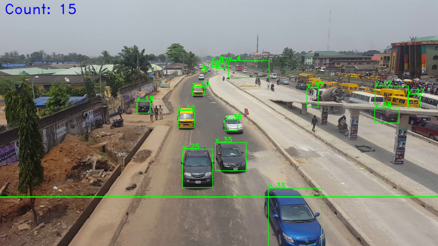

# Video-based Vehicle Counting System
My final year project (B.Sc Computer Science).

## Abstract
Traffic congestion is a major challenge in many cities around the world, especially cities in developing nations where road networks are poorly designed and cities overpopulated. Collecting quality data about the flow of traffic is crucial in traffic management, as jams can be anticipated and prevented, and vehicles can be intelligently directed to routes with less traffic. This project aims to improve the traffic situation on, and condition of Nigerian roads by implementing a vehicle counting system that provides accurate data for traffic control agencies and systems. The significances of this system include estimating traffic flow on a given road per time, predicting future traffic conditions, understanding traffic patterns and the factors that affect them, and optimizing existing manual traffic management systems. The project was developed using the Python programming language and OpenCV (an open-source library of programming functions mainly aimed at real-time Computer Vision).

## Setup
- Install Python 3 on your machine. 
- Clone this repo `git@github.com:nicholaskajoh/Vehicle-Counting.git`.
- Get video footage of a traffic scene (*see link to sample video below*).
- Create and/or use a virtual environment.
- Run `pip install -r requirements.txt` to install dependencies.
- Run `python 2_Vehicle_Counting.py` (alternate implementations in *0_Vehicle_Counting.py* and *1_Vehicle_Counting.py*).

## How it works
The vehicle counting system is made up of three main components: a detector, tracker and counter. The detector identifies vehicles in a given frame of video and returns a list of bounding boxes around the vehicles to the tracker. The tracker uses the bounding boxes to obtain regions of interest (ROIs) and uses them to track the vehicles in subsequent frames. The detector is also used to update tracker objects periodically to ensure that they are still tracking the vehicles correctly. The counter draws a counting lines across the road. When a vehicle crosses the line, the vehicle count is incremented.

## Sample video files
Download link: https://drive.google.com/drive/folders/1h8ANowkfm4TXGDg7R5Z6rnosySVc-Ht7?usp=sharing.